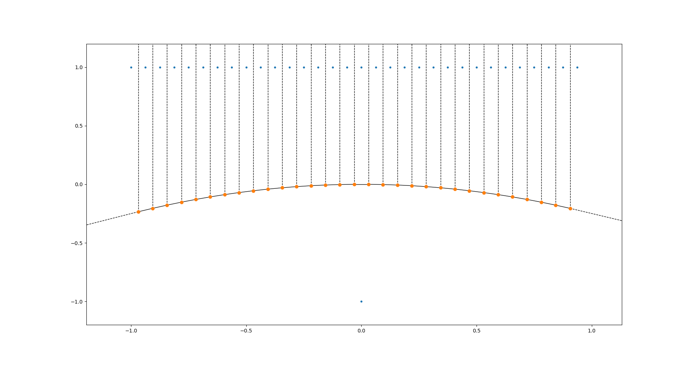

# Voronoi 2D

## Python code

Class implemented to create lines and points and to construct Voronoi tesellation.

`conda activate voronoi`

`python voronoi.py`

## C++ code

TODO: Implement Voronoi using shaders

`make`

`./voronoi2D`

## Results
One Point and One Line (Point in the center):

One Point and One Line (Arbitrary Point):

One Point and Two Lines:

Three Lines:

